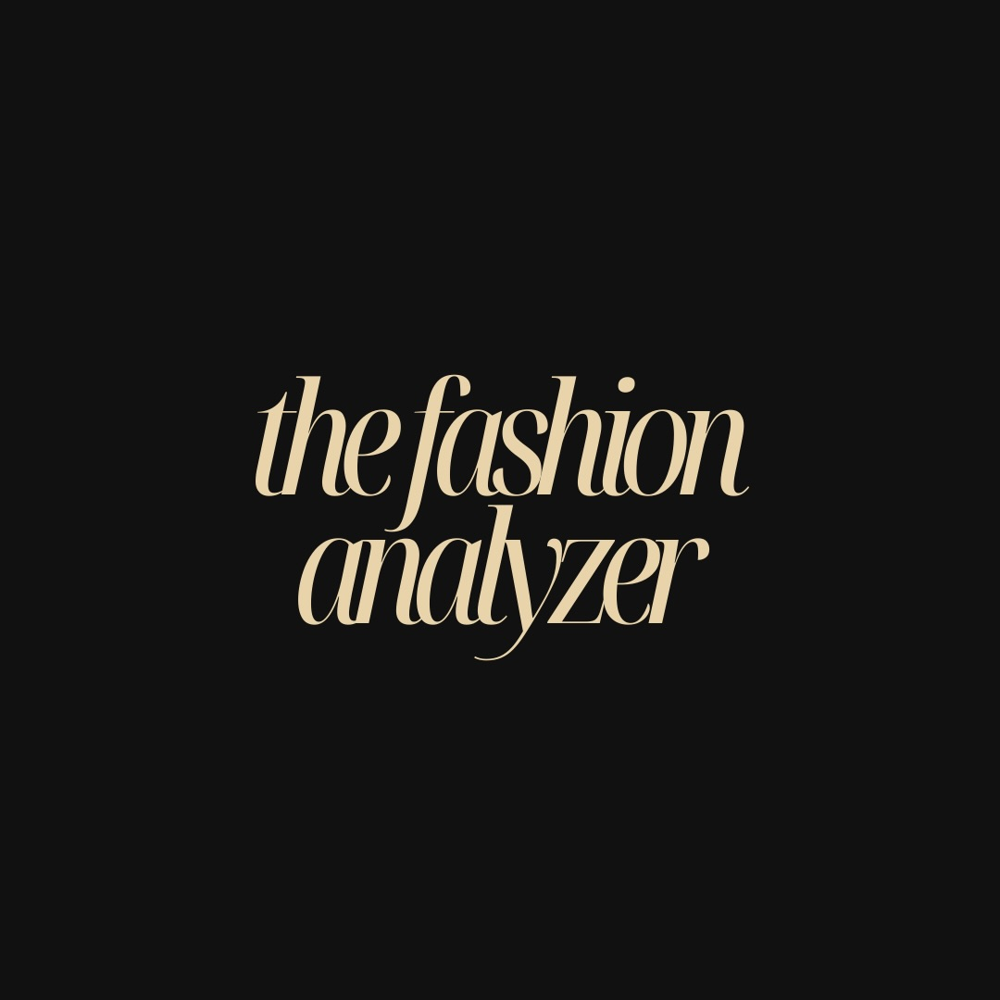
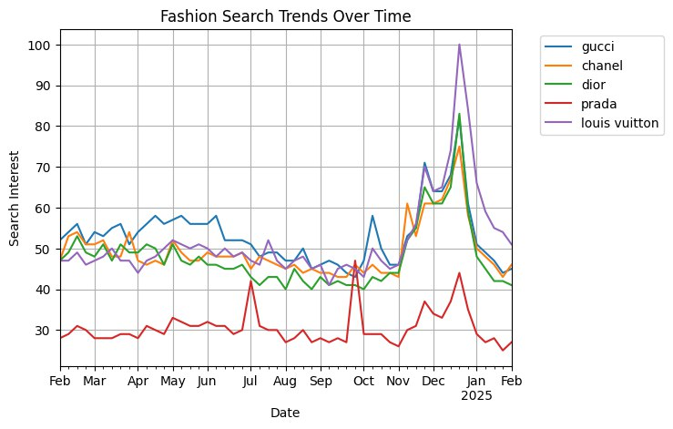
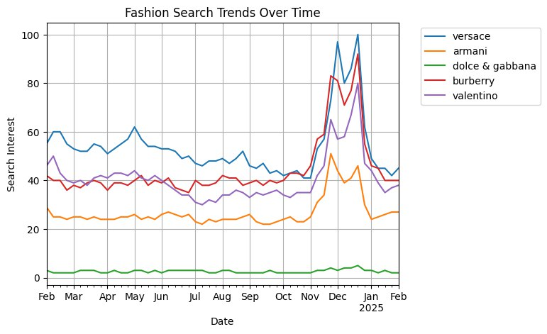

# The-Fashion-Analyzer
The Fashion Analyzer uses the Google Trends API to track fashion brands popularity. It uses this data then to visualize and create a stock market-like report. It sends notifications via the Telegram app to keep the user up-to-date on fashion brand trends. 

Right now it tracks the trends for the following fashion brands:
1. Gucci
2. Chanel
3. Dior
4. Prada
5. Louis Vuitton
6. Versace
7. Armani
8. Dolce & Gabanna
9. Burberry
10. Valentino

This is one of the many sources being used by thefashionstockmarket to analyze fashion trends.

